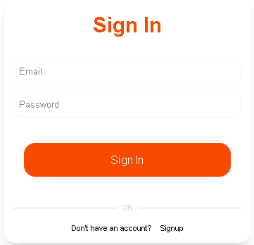
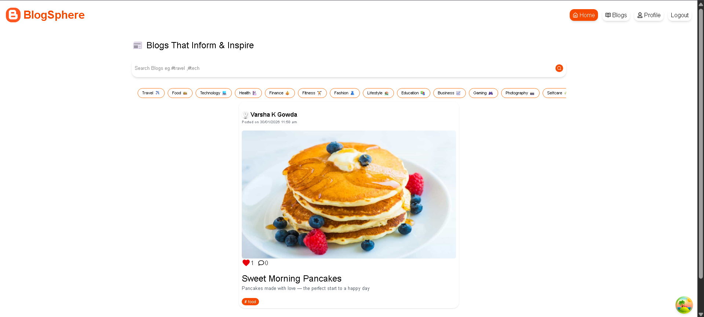
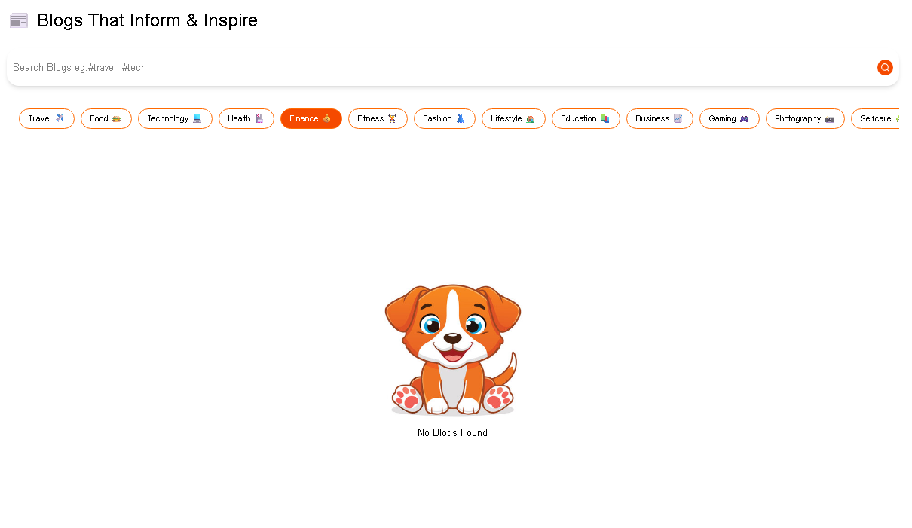

BLOG APPLICATION

A full stack Blog Application developed using Spring Boot for backend services and React.js for the frontend interface. The system allows users to register, log in, create blog posts, view blogs, update existing posts, and delete posts. The application provides a simple interface for managing personal blog content.

The backend is built using Spring Boot and exposes REST APIs for user authentication and blog management. The project follows a layered architecture including Controller, Service, and Repository layers to maintain clean code structure and separation of concerns. Spring Data JPA handles database interaction and MySQL stores application data.

The frontend is developed using React.js and communicates with backend APIs using HTTP requests. React components manage the user interface and provide pages for authentication, dashboard navigation, blog viewing, and blog creation.
Here are some screenshots of the application.

Sign In Page

Blog Page

Dashboard

 No Blogs Page

